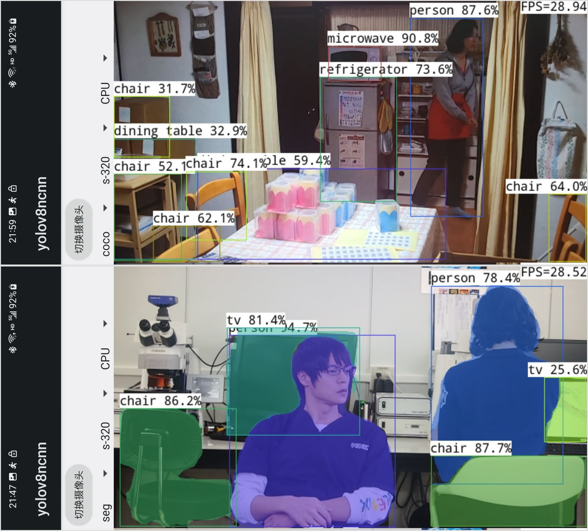
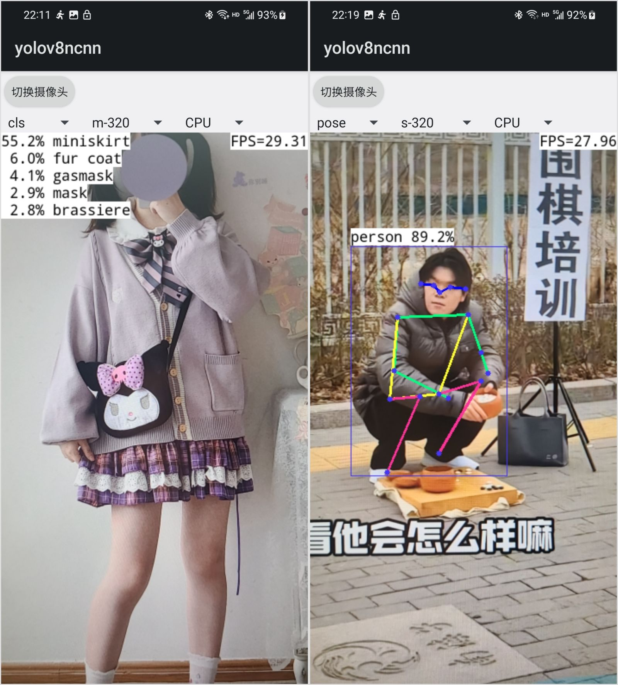
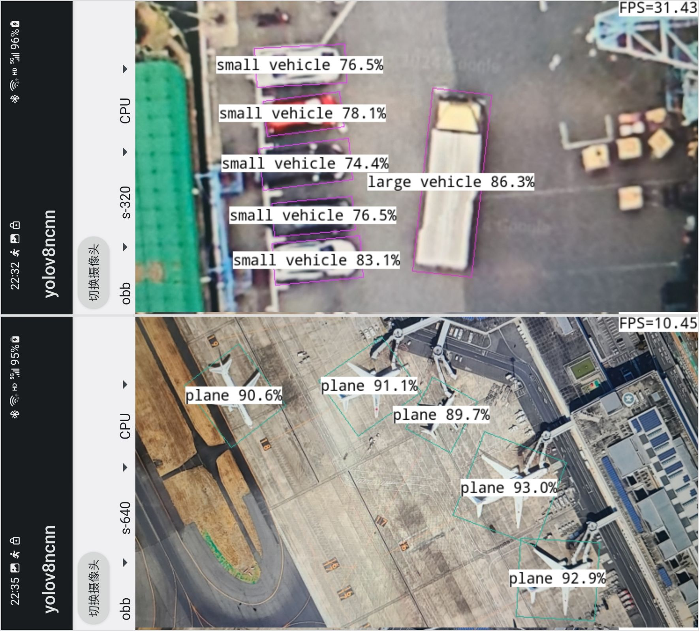

# ncnn-android-yolov8

The YOLOv8 object detection

This is a sample ncnn android project, it depends on ncnn library and opencv

https://github.com/Tencent/ncnn

https://github.com/nihui/opencv-mobile

## android apk file download
https://github.com/nihui/ncnn-android-yolov8/releases/latest

## how to build and run
### step1
https://github.com/Tencent/ncnn/releases

* Download ncnn-YYYYMMDD-android-vulkan.zip or build ncnn for android yourself
* Extract ncnn-YYYYMMDD-android-vulkan.zip into **app/src/main/jni** and change the **ncnn_DIR** path to yours in **app/src/main/jni/CMakeLists.txt**

### step2
https://github.com/nihui/opencv-mobile

* Download opencv-mobile-XYZ-android.zip
* Extract opencv-mobile-XYZ-android.zip into **app/src/main/jni** and change the **OpenCV_DIR** path to yours in **app/src/main/jni/CMakeLists.txt**

### step3
* Open this project with Android Studio, build it and enjoy!

## some notes
* Android ndk camera is used for best efficiency
* Crash may happen on very old devices for lacking HAL3 camera interface
* All models are manually modified to accept dynamic input shape
* Most small models run slower on GPU than on CPU, this is common
* FPS may be lower in dark environment because of longer camera exposure time

## screenshot




## guidelines for exporting YOLOv8 models

### 1. install

```shell
pip3 install -U ultralytics pnnx ncnn
```

### 2. export yolov8 torchscript

```shell
yolo export model=yolov8n.pt format=torchscript
yolo export model=yolov8n-seg.pt format=torchscript
yolo export model=yolov8n-pose.pt format=torchscript
yolo export model=yolov8n-cls.pt format=torchscript
yolo export model=yolov8n-obb.pt format=torchscript
```

### 3. convert torchscript with static shape

**For classification models, step 1-3 is enough.**

```shell
pnnx yolov8n.torchscript
pnnx yolov8n-seg.torchscript
pnnx yolov8n-pose.torchscript
pnnx yolov8n-cls.torchscript
pnnx yolov8n-obb.torchscript
```

### 4. modify pnnx model script for dynamic shape inference manually

Edit `yolov8n_pnnx.py` / `yolov8n_seg_pnnx.py` / `yolov8n_pose_pnnx.py` / `yolov8n_obb_pnnx.py`

- modify reshape to support dynamic image sizes
- permute tensor before concat and adjust concat axis
- drop post-process part

<table>
<tr align="center"><td>model</td><td>before</td><td>after</td></tr>
<tr>
<td>det</td>
<td>

```python
v_165 = v_142.view(1, 144, 6400)
v_166 = v_153.view(1, 144, 1600)
v_167 = v_164.view(1, 144, 400)
v_168 = torch.cat((v_165, v_166, v_167), dim=2)
# ...
```
</td>
<td>

```python
v_165 = v_142.view(1, 144, -1).transpose(1, 2)
v_166 = v_153.view(1, 144, -1).transpose(1, 2)
v_167 = v_164.view(1, 144, -1).transpose(1, 2)
v_168 = torch.cat((v_165, v_166, v_167), dim=1)
return v_168
```
</td>
</tr>
<tr>
<td>seg</td>
<td>

```python
v_144 = v_143.view(1, 32, 6400)
v_150 = v_149.view(1, 32, 1600)
v_156 = v_155.view(1, 32, 400)
v_157 = torch.cat((v_144, v_150, v_156), dim=2)
# ...
v_191 = v_168.view(1, 144, 6400)
v_192 = v_179.view(1, 144, 1600)
v_193 = v_190.view(1, 144, 400)
v_194 = torch.cat((v_191, v_192, v_193), dim=2)
# ...
v_215 = (v_214, v_138, )
return v_215
```
</td>
<td>

```python
v_144 = v_143.view(1, 32, -1).transpose(1, 2)
v_150 = v_149.view(1, 32, -1).transpose(1, 2)
v_156 = v_155.view(1, 32, -1).transpose(1, 2)
v_157 = torch.cat((v_144, v_150, v_156), dim=1)
# ...
v_191 = v_168.view(1, 144, -1).transpose(1, 2)
v_192 = v_179.view(1, 144, -1).transpose(1, 2)
v_193 = v_190.view(1, 144, -1).transpose(1, 2)
v_194 = torch.cat((v_191, v_192, v_193), dim=1)
return v_194, v_157, v_138
```
</td>
</tr>
<tr>
<td>pose</td>
<td>

```python
v_137 = v_136.view(1, 51, 6400)
v_143 = v_142.view(1, 51, 1600)
v_149 = v_148.view(1, 51, 400)
v_150 = torch.cat((v_137, v_143, v_149), dim=-1)
# ...
v_184 = v_161.view(1, 65, 6400)
v_185 = v_172.view(1, 65, 1600)
v_186 = v_183.view(1, 65, 400)
v_187 = torch.cat((v_184, v_185, v_186), dim=2)
# ...
```
</td>
<td>

```python
v_137 = v_136.view(1, 51, -1).transpose(1, 2)
v_143 = v_142.view(1, 51, -1).transpose(1, 2)
v_149 = v_148.view(1, 51, -1).transpose(1, 2)
v_150 = torch.cat((v_137, v_143, v_149), dim=1)
# ...
v_184 = v_161.view(1, 65, -1).transpose(1, 2)
v_185 = v_172.view(1, 65, -1).transpose(1, 2)
v_186 = v_183.view(1, 65, -1).transpose(1, 2)
v_187 = torch.cat((v_184, v_185, v_186), dim=1)
return v_187, v_150
```
</td>
</tr>
<tr>
<td>obb</td>
<td>

```python
v_137 = v_136.view(1, 1, 16384)
v_143 = v_142.view(1, 1, 4096)
v_149 = v_148.view(1, 1, 1024)
v_150 = torch.cat((v_137, v_143, v_149), dim=2)
# ...
v_186 = v_163.view(1, 79, 16384)
v_187 = v_174.view(1, 79, 4096)
v_188 = v_185.view(1, 79, 1024)
v_189 = torch.cat((v_186, v_187, v_188), dim=2)
# ...
```
</td>
<td>

```python
v_137 = v_136.view(1, 1, -1).transpose(1, 2)
v_143 = v_142.view(1, 1, -1).transpose(1, 2)
v_149 = v_148.view(1, 1, -1).transpose(1, 2)
v_150 = torch.cat((v_137, v_143, v_149), dim=1)
# ...
v_186 = v_163.view(1, 79, -1).transpose(1, 2)
v_187 = v_174.view(1, 79, -1).transpose(1, 2)
v_188 = v_185.view(1, 79, -1).transpose(1, 2)
v_189 = torch.cat((v_186, v_187, v_188), dim=1)
return v_189, v_150
```
</td>
</tr>
</table>

### 5. re-export yolov8 torchscript

```shell
python3 -c 'import yolov8n_pnnx; yolov8n_pnnx.export_torchscript()'
python3 -c 'import yolov8n_seg_pnnx; yolov8n_seg_pnnx.export_torchscript()'
python3 -c 'import yolov8n_pose_pnnx; yolov8n_pose_pnnx.export_torchscript()'
python3 -c 'import yolov8n_obb_pnnx; yolov8n_obb_pnnx.export_torchscript()'
```

### 6. convert new torchscript with dynamic shape

**Note the shape difference for obb model**

```shell
pnnx yolov8n_pnnx.py.pt inputshape=[1,3,640,640] inputshape2=[1,3,320,320]
pnnx yolov8n_seg_pnnx.py.pt inputshape=[1,3,640,640] inputshape2=[1,3,320,320]
pnnx yolov8n_pose_pnnx.py.pt inputshape=[1,3,640,640] inputshape2=[1,3,320,320]
pnnx yolov8n_obb_pnnx.py.pt inputshape=[1,3,1024,1024] inputshape2=[1,3,512,512]
```

### 7. now you get ncnn model files

```shell
mv yolov8n_pnnx.py.ncnn.param yolov8n.ncnn.param
mv yolov8n_pnnx.py.ncnn.bin yolov8n.ncnn.bin
mv yolov8n_seg_pnnx.py.ncnn.param yolov8n_seg.ncnn.param
mv yolov8n_seg_pnnx.py.ncnn.bin yolov8n_seg.ncnn.bin
mv yolov8n_pose_pnnx.py.ncnn.param yolov8n_pose.ncnn.param
mv yolov8n_pose_pnnx.py.ncnn.bin yolov8n_pose.ncnn.bin
mv yolov8n_obb_pnnx.py.ncnn.param yolov8n_obb.ncnn.param
mv yolov8n_obb_pnnx.py.ncnn.bin yolov8n_obb.ncnn.bin
```
